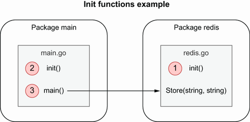

## 2.3 滥用的 init 函数

`init` 函数有时会在Go应用程序中被滥用。潜在的后果是糟糕的错误管理或难以理解的代码流。让我们重新思考一下什么是init函数。然后我们将查看何时建议或不建议使用它们。

### 2.3.1 概念

init 函数是不带参数且不返回结果的函数（func()函数）。初始化包时，会评估包中的所有常量和变量声明。然后，执行初始化函数。下面是一个 `main` 包的例子：

```go
package main

import "fmt"

var a = func() int {
        fmt.Println("var")
        return 0
}()

func init() {
        fmt.Println("init")
}

func main() {
        fmt.Println("main")
}
```

运行此示例将打印以下输出：

```go
var
init
main
```

初始化包时会执行一个 `init` 函数。在下面的示例中，我们将定义两个包 `main` 和 `redis`，其中 `main` 依赖于 `redis`：

```go
package main

import (
        "fmt"

        "redis"
)

func init() {
        // ...
}

func main() {
        err := redis.Store("foo", "bar")
        // ...
}
```

```go
package redis
// imports

func init() {
	// ...
}

func Store(key, value string) error {
	// ...
}
```

因为 `main` 依赖 `redis` 先执行，`redis` 包的init 函数将是第一个执行，然后是 `main` 包的 init，然后是 `main` 函数本身，如下图：



我们可以为每个包定义多个初始化函数。在这种情况下，包内的 `init` 函数的执行顺序是基于源文件的字母顺序。例如，如果一个包包含一个 `a.go` 和一个 `b.go` 文件，并且都具有一个 `init` 函数，则将首先执行 `a.go` 的 `init`函数。我们不应该依赖包中初始化函数的顺序。实际上，这可能很危险，因为可以重命名源文件，从而可能影响执行顺序。

我们还可以在同一个源文件中定义多个初始化函数。例如，这段代码是完全有效的：

```go
package main

import "fmt"

func init() {
        fmt.Println("init 1")
}

func init() {
        fmt.Println("init 2")
}

func main() {
}
```

执行的第一个 `init` 函数是源顺序中的第一个：

```go
init 1
init 2
```

我们也可以使用 `init` 函数来解决副作用。在下一个示例中，我们将定义一个对 `foo` 没有强依赖关系的 `main` 包（例如，不直接使用公共函数）。但是，它需要初始化 `foo` 包。我们可以这样使用 `_` 操作符：

```go
package main

import (
        "fmt"

        _ "foo"
)

func main() {
        // ...
}
```

在这种情况下，`foo` 包将在 `main` 之前初始化。因此，`foo` 的 `init` 函数将被执行。

`init` 函数的另一个方面是它不能被直接调用：

```go
package main

func init() {}

func main() {
        init()
}
```

此代码产生以下编译错误：

```shell
$ go build .
./main.go:6:2: undefined: init
```

现在我们对 `init` 函数的工作原理有了新的认识，让我们看看何时应该使用或不使用它们。

### 2.3.2 什么时候使用init函数？

首先，让我们看一个使用 `init` 函数可能被认为不合适的示例：保存数据库连接池。

在`init`函数中，我们将使用 `sql.Open` 打开一个数据库。我们将使这个数据库成为函数以后可以使用的全局变量。

```go
var db *sql.DB

func init() {
        dataSourceName := os.Getenv("MYSQL_DATA_SOURCE_NAME")
        d, err := sql.Open("mysql", dataSourceName)
        if err != nil {
                log.Panic(err)
        }
        err = d.Ping()
        if err != nil {
                log.Panic(err)
        }
        db = d
}
```

在本例中，我们打开数据库，检查是否可以 `ping` 通，然后将其分配给全局变量。我们应该如何看待我们的实施？让我们描述三个主要缺点。

首先，`init` 函数中的错误管理是有限的。实际上，由于 `init` 函数不返回任何错误，因此发出错误信号的唯一方法之一就是 `panic`，导致应用程序停止。在我们的示例中，如果打开数据库失败，无论如何都可以停止应用程序。但是，不一定要由包本身来决定是否停止应用程序。也许调用者可能更喜欢实现重试或使用回退机制。在 `init` 函数中打开数据库会阻止客户端包实现它们的错误处理逻辑。

另一个重要的缺点与测试有关。如果我们在这个文件中添加测试，`init` 函数将在运行测试用例之前执行，这不一定是我们想要的。例如，如果我们在不需要创建此连接的实用程序函数上添加单元测试。因此，它会使编写单元测试变得复杂。

最后一个缺点是它需要将数据库连接池分配给全局变量。全局变量有一些严重的缺点，例如：
* 任何功能都可以在包中更改它们。
* 它还可以使单元测试更加复杂，因为依赖于它的函数将不再被隔离。

在大多数情况下，我们应该倾向于封装一个变量而不是让它保持全局。

由于这些原因，之前的初始化可能应该作为普通旧函数的一部分处理，如下所示：

```go
func createClient(dataSourceName string) (*sql.DB, error) {
        db, err := sql.Open("mysql", dataSourceName)
        if err != nil {
                return nil, err
        }
        if err = db.Ping(); err != nil {
                return nil, err
        }
        return db, nil
}
```

使用此函数，我们解决了讨论的主要缺点：
* 错误处理的责任留给调用者
* 可以创建一个集成测试来检查这个函数的工作。
* 连接池封装在函数内。

但是，我们是否应该不惜一切代价避免使用 `init` 函数？不是这样。在一些用例中，`init` 函数可能非常有用。例如，Go 官方博客（which is implemented in Go）使用一个 `init` 函数来设置静态 `HTTP` 配置：

```go
func init() {
        redirect := func(w http.ResponseWriter, r *http.Request) {
                http.Redirect(w, r, "/", http.StatusFound)
        }
        http.HandleFunc("/blog", redirect)
        http.HandleFunc("/blog/", redirect)

        static := http.FileServer(http.Dir("static"))
        http.Handle("/favicon.ico", static)
        http.Handle("/fonts.css", static)
        http.Handle("/fonts/", static)

        http.Handle("/lib/godoc/", http.StripPrefix("/lib/godoc/",
                http.HandlerFunc(staticHandler)))
}
```

在这个例子中，`init` 函数不能失败（`http.HandleFunc` 可能会触发 panic，但前提是处理程序为`nil`，这里不是这种情况）。同时，不需要创建任何全局变量，也不会影响可能的单元测试。因此，此示例是一个很好的示例，其中 `init` 函数可能会有所帮助。

总之，我们已经看到 `init` 函数可能会导致一些问题：

* 限制错误管理。
* 它可能使如何实现测试变得复杂（例如，要设置外部依赖项，这对于单元测试的范围可能不是必需的）
* 如果初始化需要设置状态，则必须通过全局变量来完成。

我们应该谨慎使用 `init` 函数。正如我们在本节中所见，它们在某些情况下可能会有所帮助，例如定义静态配置。否则，在大多数情况下，我们应该通过 `ad‑hoc` 函数来处理初始化。