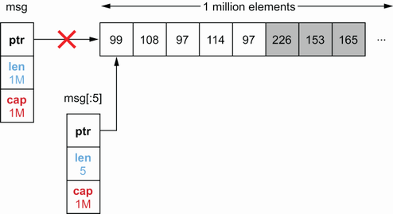
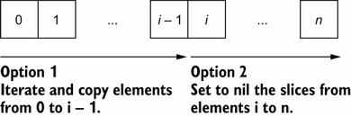

## 3.10 切片与内存泄漏

本节将展示对现有切片或数组进行切片在某些情况下会导致内存泄漏。 我们将讨论两种情况：一种是容量泄漏的情况，另一种是与指针有关的情况。

### 3.10.1 容量泄漏

对于第一种情况，让我们想象实现一个自定义二进制协议。 一条消息可以包含一百万字节，前五个字节代表消息类型。 在我们的代码中，我们使用这些消息，出于审计目的，我们希望将最新的 1000 条消息类型存储在内存中。 我们的功能框架如下：

```go
func consumeMessages() {
        for {
                msg := receiveMessage()
                // Do something with msg
                storeMessageType(getMessageType(msg))
        }
}

func getMessageType(msg []byte) []byte {
        return msg[:5]
}
```

`getMessageType` 函数通过对输入切片进行切片来计算消息类型。 我们测试了这个实现，一切都很好。 但是，当我们部署我们的应用程序时，我们注意到我们的应用程序消耗了大约 1 GB 的内存。 这怎么可能？

使用 `msg[:5]` 对 `msg` 进行切片操作会创建一个 5 长度的切片。 但是，它的容量与初始切片的容量相同。 剩余的元素仍然分配在内存中，即使最终 `msg` 将不再被引用。 让我们看一个具有一百万字节的大消息长度的示例：



正如我们在这个图中可以注意到的，切片的后备数组在切片操作之后仍然包含一百万字节。 因此，如果我们在内存中保留 1000 条消息，而不是存储大约 5 KB，我们将保留大约 1 GB。

那么我们能做些什么来解决这个问题呢？ 通过制作切片副本而不是原始切片 `msg`：

```go
func getMessageType(msg []byte) []byte {
        msgType := make([]byte, 5)
        copy(msgType, msg)
        return msgType
}
```

当我们执行复制时，`msgType` 是一个长度为 5、容量为 5 的切片，而与接收到的消息的大小无关。 因此，我们将只存储每种消息类型的 5 个字节。

> **Note** 在这里，`getMessageType` 将返回初始切片的缩小版本：一个长度为 5、容量为 5 的切片。 然而，GC 是否能够从字节 5 中回收不可访问的空间？ Go 规范没有正式指定行为。
> 但是，通过使用 `runtime.Memstats`，我们可以记录有关内存分配器的统计信息，例如在堆上分配的字节数：
```go
func printAlloc() {
        var m runtime.MemStats
        runtime.ReadMemStats(&m)
        fmt.Printf("%d KB\n", m.Alloc/1024)
}
```
>如果我们在调用 `getMessageType` 和 `runtime.GC()` 之后调用此函数来强制运行垃圾回收，我们会注意到无法回收的空间没有被回收。 整个后备阵列仍将存在于内存中。
因此，使用完整的切片表达式不是一个有效的选项（除非 Go 的未来更新会解决它）。
使用完整的切片表达式来解决这个问题怎么样？

```go
func getMessageType(msg []byte) []byte {
        return msg[:5:5]
}
```

根据经验，我们必须记住，对大切片或数组进行切片可能会导致潜在的高内存消耗。 实际上，GC 不会回收剩余空间，尽管只使用了几个元素，我们仍可以保留一个大的后备数组。 使用切片复制是防止这种情况的解决方案。

###3.10.2 切片与指针

我们已经看到，由于切片容量，切片会导致泄漏。 然而，元素呢？ 这些仍然是支持数组的一部分，但超出了长度范围。 GC 会收集它们吗？

让我们使用包含字节切片的 `Foo` 结构来研究这个问题：

```go
type Foo struct {
        v []byte
}
```

我们想在每个步骤后检查内存分配：

* 分配一片1000个 `Foo` 元素
* 迭代每个 `Foo` 元素，并为每个 `v` 切片分配1 MB
* 使用切片调用仅返回前两个元素的 `keepFirstTwoElementsOnly`，然后调用GC

我们想看看调用 `keepFirstTwoElementsOnly` 和 GC 后内存的行为。 这是 Go 中的场景（我们将重用之前定义的 `printAlloc` 函数）：

```go
func main() {
        foos := make([]Foo, 1_000)
        printAlloc()

        for i := 0; i < len(foos); i++ {
                foos[i] = Foo{
                        v: make([]byte, 1024*1024),
                }
        }
        printAlloc()

        two := keepFirstTwoElementsOnly(foos)
        runtime.GC()
        printAlloc()
        runtime.KeepAlive(two)
}

func keepFirstTwoElementsOnly(foos []Foo) []Foo {
        return foos[:2]
}
```

我们分配 `foos` 切片，为每个元素分配1 MB的切片，然后调用 `keepFirstTwoElementsOnly` 和GC。最后，我们使用 `runtime.KeepAlive` 在GC之后保留对两个变量的引用，这样就不会被收集。

我们可能期望 GC 收集剩余的 998 个 `Foo` 元素和为切片分配的数据，因为这些元素无法再访问。 然而，事实并非如此。 例如，代码可以打印以下内容：

```go
83 KB
1024072 KB
1024073 KB
```

第一步分配大约 83 KB 的数据。 事实上，我们分配了 1000 个 Foo 的零值。 第二步为每个切片分配 1 MB，这增加了内存。 但是，我们可以注意到 GC 在最后一步之后没有收集剩余的 998 个元素。 什么原因？

规则如下，在使用 slice 时必须牢记：如果元素是指针或带有指针字段的结构，则 GC 不会回收这些元素。 在这里，由于 `Foo` 包含一个切片（并且切片是支持数组顶部的指针），剩余的 998 个 `Foo` 元素及其切片将不会被回收。 因此，即使这 998 个元素不能再被访问，只要 `keepFirstTwoElementsOnly` 返回的变量被引用，它们就会留在内存中。

那么有哪些选项可以确保我们不会泄露剩余的 `Foo` 元素呢？

同样，第一个选项是创建切片的副本：

```go
func keepFirstTwoElementsOnly(foos []Foo) []Foo {
        res := make([]Foo, 2)
        copy(res, foos)
        return res
}
```

当我们复制切片的前两个元素时，GC 将知道这 998 个元素将不再被引用，并且可以被 GC 收集。

如果我们想保持 1000 个元素的底层容量，还有第二种选择，例如，将剩余元素的切片显式标记为 nil：

```go
func keepFirstTwoElementsOnly(foos []Foo) []Foo {
        for i := 2; i < len(foos); i++ {
                foos[i].v = nil
        }
        return foos[:2]
}
```

在这里，我们返回一个长度为 2、容量为 1000 的切片，但我们将剩余元素的切片设置为 nil。 因此，GC 将能够收集 998 个支持数组。

那么，哪个选项是最好的呢？ 如果我们不想保留 1000 个元素的容量，第一个选项可能是最好的。 然而，该决定也可以取决于元素的比例。 让我们看一个可视化示例，假设切片包含 n 个元素，我们希望在其中保留 i 个元素：



第一个选项创建 `i` 元素的副本。因此，它必须从元素 0 迭代到 `i`。同时，第二个选项将剩余的切片标记为 nil，因此它必须从元素 `i` 迭代到 `n`。如果性能很重要并且 `i` 比 0 更接近 `n`，我们可以考虑使用第二种选择。它需要迭代更少的元素（至少，可能值得对这两个选项进行基准测试）。

在本节中，我们看到了两个潜在的内存泄漏问题。第一个是关于对现有切片或数组进行切片以保留容量。如果我们处理大切片并将它们重新切片以仅保留其中的一小部分，则大量内存将保持分配但未使用。第二个是当我们对元素是指针或带有指针字段的结构使用切片操作时，我们应该知道 GC 不会回收这些元素。在这种情况下，这两个选项是执行复制或将剩余元素或其字段显式标记为 nil。

现在，让我们开始在初始化的上下文中讨论映射。