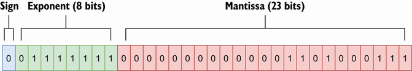

## 3.3 不理解的浮点型

在 Go 中，有两种浮点类型（如果我们省略虚数）：`float32` 和 `float64`。 发明浮点的概念是为了解决整数的主要问题：它们无法表示小数值。 为了避免意外，我们必须知道浮点算术是实数算术的近似值。 让我们发现使用近似值的影响以及如何提高准确性。 

让我们看一个乘法示例：

```go
var n float32 = 1.0001
fmt.Println(n * n)
```

我们可能希望这段代码打印 1.0001 * 1.0001: 1.00020001 的结果，对吧？ 但是，在大多数 x86 处理器上运行此代码会打印 1.0002。 我们该如何解释呢？ 让我们了解浮点数的算法。

如果我们以 `float64` 类型为例，我们应该注意到在 `math.SmallestNonzeroFloat64`（`float64` 最小值）和 `math MaxFloat64`（`float64` 最大值）之间存在无限多个实数值。 相反，`float64` 类型的位数是有限的：64。由于不可能使无限值适合有限空间，因此我们必须使用近似值。 因此，可能会失去精度。 `float32` 类型也是如此。

Go 中的浮点数遵循 IEEE-754 标准，其中一些位表示尾数，其他位表示指数。 尾数是基值，而指数是应用于尾数的乘数。 在单精度浮点数（`float32`）中，8 位表示指数，23 位表示尾数。 在双精度浮点 (`float64`) 中，指数和尾数分别为 11 位和 52 位。 剩下的位是符号。 要将浮点数转换为小数，我们进行以下计算：

```go
sign * 2^exponent * mantissa
```

让我们看看1.0001作为 `float32` 的表示：



指数使用 8 位过量/偏置表示法。 在这里，01111111 的指数值表示 2^0，而尾数等于 1.000100016593933（本节的范围不是解释转换的工作原理）。 因此，十进制值等于 1 * 2^0 * 1.000100016593933。 因此，我们存储到单精度浮点中的不是 1.0001，而是 1.000100016593933。 缺乏精度会影响存储值的准确性。

一旦我们了解到 `float32` 和 `float64` 是近似值，开发人员对我们有什么影响？

第一个含义与比较有关。 使用 `==` 运算符比较两个浮点数可能会导致不准确。 相反，我们应该比较它们的差异小于某个小的误差值。 例如，`testify` 测试库有一个 `InDelta` 函数来断言两个值在彼此的给定增量内。

我们还要记住，浮点计算的结果取决于实际的处理器。 大多数处理器都有一个浮点单元 (FPU) 来处理此类计算。 不能保证在一台机器上执行的一个结果在另一台具有不同 FPU 的机器上是相同的。 同样，使用 delta 比较两个值可以成为跨不同机器实现有效测试的解决方案。

> **Note** 这里有一个构建这些特殊类型数字的例子：
```go
var a float64
positiveInf := 1 / a
negativeInf := -1 / a
nan := a / a
fmt.Println(positiveInf, negativeInf, nan)
```

这段代码输出如下：

```go
+Inf -Inf NaN
```

我们可以使用 `math.IsInf` 检查浮点数是否无限，以及使用 `math.IsNaN` 检查浮点数是否为 NaN。

Go还有三种特殊的浮点数：

* 正无限。
* 负无限。
* NaN(不是一个数字)，未定义或无法表示的操作的结果。 根据 IEEE-754，唯一满足 f != f 的浮点数。
  
我们已经看到十进制到浮点的转换会导致精度下降。 这是由于转换导致的错误。 我们还必须注意，错误可以在一系列浮点运算中累积。

让我们看一个示例，其中有两个函数将以不同的顺序执行相同的操作序列。 f1 将首先将 float64 初始化为 10000，然后将 1.0001 重复添加到此结果（n 次）。 相反， f2 将执行相同的操作，但顺序相反（最后加 10000）。

```go
func f1(n int) float64{
    result := 10_000.
    for i := 0; i < n; i++ {
        result += 1.0001
    }
    return result
}

func f2(n int) float64 {
    result := 0.
    for i := 0; i < n; i++ {
        result += 1.0001
    }
    return result + 10_000.
}
```

让我们在x86处理器上运行这些功能，同时改变n：

| n   | 期望结果     | f1  | f2  |
|-----|----------|-----|-----|
| 10  | 10010.01 |  10010.000999999993   |10010.001     |
| 1k  | 11000.1  |11000.099999999293     |11000.099999999982     |
| 1m  |1.0101e+06          |1.0100999999761417e+06     |1.0100999999766762e+06     |

我们可以注意到，n越大，不精确就越大。然而，我们也可以看到f2精度优于f1。事实上，我们应该记住，浮点计算的顺序可能会影响结果的准确性。

在执行一系列加法和减法时，我们应该将操作分组以添加或减去具有相似数量级的值，然后再添加或减去那些幅度不接近的值。 由于 f2 执行了 10000 加法，因此最终产生的结果比 f1 更准确。

乘法和除法呢？让我们想象一下，我们想计算以下内容：

```go
a * (b + c)
```

如我们所知，这种计算等于：

```go
a * b + a * c
```

让我们用与 `b` 和 `c` 不同的数量级运行这两个计算：

```go
a := 100000.001
b := 1.0001
c := 1.0002

fmt.Println(a * (b + c))
fmt.Println(a*b + a*c)
```

```go
200030.00200030004
200030.0020003
```

确切的结果是 200030.002。 因此，第一次计算的准确度最差。 确实，在进行加减乘除的浮点运算时，我们必须先完成乘除运算才能获得更好的精度。 有时，它可能会影响执行时间，就像前面的示例一样，它需要三个操作而不是两个。 在这种情况下，这是准确性和执行时间之间的选择。

Go的 `float32` 和 `float64` 是近似值。因此，我们必须牢记一些规则：

* 在比较两个浮点数时，我们应该比较它们的差异在可接受的范围内。

* 我们应该对操作进行类似数量级的分组，以便在执行加法或减法时提高准确性。

* 同样，为了提高准确性，如果一系列操作需要加法、减法、乘法和除法，我们应该先执行乘法和除法。

以下部分将开始深入研究切片，并讨论两个关键概念：切片的长度和容量。