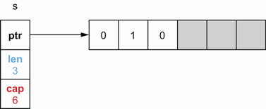
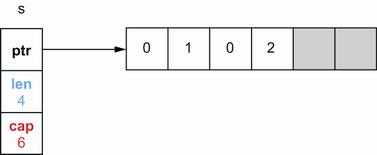
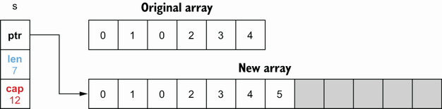
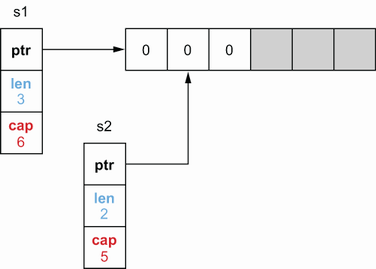
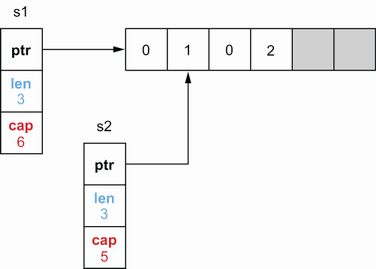
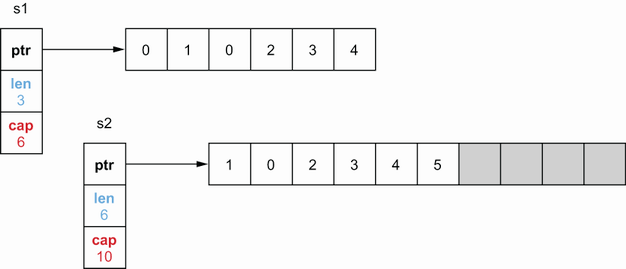

## 3.4 不理解的切片长度和容量

对于 Go 开发人员来说，混合切片长度和容量或者不彻底理解它们是很常见的。 吸收这两个概念对于有效处理核心操作至关重要，例如切片初始化和通过追加、复制或切片添加元素。 否则，它可能会导致对切片的使用欠佳，甚至会导致内存泄漏，正如我们将在后面的部分中看到的那样。

在 Go 中，切片由数组支持。 这意味着切片的数据连续存储在数组数据结构中。 如果后备数组已满，切片还处理添加元素的逻辑，或者如果后备数组几乎为空，如何缩小后备数组。

在内部，切片包含指向后备数组的指针以及长度和容量。 长度是切片包含的元素数，而容量是后备数组中的元素数。 让我们通过几个例子来说明问题。

首先，让我们初始化一个给定长度和容量的切片：

```go
s := make([]int, 3, 6)
```

表示长度的第一个参数是强制性的。然而，代表容量的第二个参数是可选的。

下图显示了内存中此代码的结果：


`make` 创建了一个包含六个元素（容量）的数组。 然而，由于长度设置为 3，Go 只初始化了前三个元素。 作为 `[]int` 类型的切片，前三个元素被初始化为 `int` 的零值：0。灰色元素已分配但尚未使用。

如果我们打印这个切片，我们将得到长度范围内的元素：`[0 0 0]`。

如果我们将 `s[1]` 设置为 1，它将更新切片的第二个元素，而不会影响其长度或容量，如下图所示：



但是，禁止访问超出长度范围的元素，即使它已经在内存中分配。 例如，s[4] = 0 会引发panic：

```go
panic: runtime error: index out of range [4] with length 3
```

那么，我们如何利用切片的剩余空间呢？通过使用 `append` 内置功能：

```go
s = append(s, 2)
```

此代码附加到现有s切片一个新元素。它使用第一个灰色元素（已分配但尚未使用）来存储元素2，如下图所示：



该切片的长度已从三个更新为四个，因为该切片现在包含四个元素。

现在，如果我们再添加三个元素，使备份数组不够大，会发生什么？

```go
s = append(s, 3, 4, 5)
fmt.Println(s)
```

如果我们运行此代码，我们可以注意到切片能够满足我们的请求：

```go
[0 1 0 2 3 4 5]
```

由于数组是一个固定大小的结构，它可以存储新元素直到元素 `4`。一旦我们想要插入元素 `5`，因为数组已经满了，Go 内部通过增加一倍容量创建了另一个数组，复制了所有元素 ，然后插入元素 5：



> **Note** 在 Go 中，一个 slice 通过翻倍增长，直到它包含 1024 个元素，之后它每次增长 25%。

切片现在引用新的支持数组。 之前的后备数组会发生什么？ 如果它不再被引用，如果在堆上分配它最终将被垃圾收集器 (GC) 释放（我们将在不了解堆栈与堆中讨论堆内存以及 GC 如何工作在不了解 GC 是如何工作的）。

现在，切片会发生什么？ 切片是通过提供半开范围对数组或切片进行的操作； 包括第一个索引，而排除第二个索引。 现在让我们看看影响：

```go
s1 := make([]int, 3, 6)
s2 := s1[1:3]
```

下图显示了内存中的结果：



首先，`s1` 被创建为3-长度、6个容量的切片。当通过切片 `s1` 创建 `s2` 时，两个切片都引用相同的备份数组。然而，`s2` 从另一个索引开始：1.因此，它的长度和容量与 `s1` 不同：2-长度，5-容量。

如果我们更新 `s1[1]` 或 `s2[0]` ，将对同一数组进行更改。因此，它将在两个切片上都可见，如下图所示：


现在，如果我们向 `s2` 附加一个元素会发生什么？这个代码也会改变 `s1` 吗？

```go
s2 = append(s2, 2)
```

共享备份数组被修改，但只有 `s2` 的长度才会改变：



`s1`仍然是一个3-长度、6-个容量的切片。因此，如果我们打印 `s1` 和 `s2`，添加的元素仅对 `s2` 可见：

```go
s1=[0 1 0], s2=[1 0 2]
```

重要的是要理解这种行为，不要在使用 `append` 时做出错误的假设。

> **Note** 在这些示例中，后备数组是内部的，Go 开发人员无法直接使用。 唯一的例外是通过对现有数组进行切片创建切片时。

最后一件事要注意。 如果我们一直将元素附加到 `s2` 直到后备数组已满怎么办？ 状态记忆会是什么？ 让我们再添加三个元素，这样后备数组就没有足够的容量：

```go
s2 = append(s2, 3)
s2 = append(s2, 4)
s2 = append(s2, 5)
```

此代码将导致创建另一个备份数组：



我们可以注意到，`s1` 和 `s2` 现在引用了两个不同的数组。 事实上，由于 `s1` 仍然是一个长度为 3、容量为 6 的切片，它仍然有一些可用的缓冲区，所以它一直引用初始数组。 此外，正如我们所注意到的，新的后备数组是通过从 s2 的第一个索引中复制初始数组来创建的。 这就是为什么新数组从元素 1，而不是 0 开始的原因。

总而言之，切片长度是切片中可用元素的数量，而切片容量是后备数组中的元素数量。 将元素添加到完整切片（长度 == 容量）会导致创建具有新容量的新后备数组，复制前一个数组中的所有元素，并将切片指针更新为新数组。

在下一节中，我们将在切片初始化中使用长度和容量的概念。