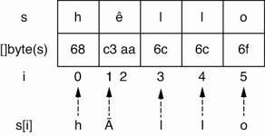

## 5.2 不准确的字符串迭代

对字符串进行迭代是开发人员的常见操作。也许，我们想要检索所有符文或实现自定义函数来搜索特定的子字符串。在这两种情况下，我们都必须迭代字符串的不同符文。然而，很容易对迭代的工作方式感到困惑。

让我们深入研究一个具体的例子。在这里，我们要打印不同的符文及其对应的位置：

```go
s := "hêllo"
for i := range s {
        fmt.Printf("position %d: %c\n", i, s[i])
}
fmt.Printf("len=%d\n", len(s))
```

我们使用 `range` 运算符来迭代 `s` ，然后，我们想使用它在字符串中的索引来打印符文：

```shell
position 0: h
position 1: Ã
position 3: l
position 4: l
position 5: o
len=6
```

这段代码并没有做我们最初想要的。让我们强调三点：

* 第二个符文不是 `ê` 而是 `Ã`。
* 我们从位置 1 跳到位置 3，那么位置 2 有什么？ 
* `len` 返回计数为 6， 而 `s` 仅包含 5个符文。

让我们从最新的观察开始。我们已经提到 `len` 不是返回字符串中符文的数量，而是返回字节数。正如我们为 `s` 分配的字符串文字，`s` 是一个 UTF-8 字符串。同时，特殊字符 `ê` 不是在单个字节中编码的；它需要两个字节。因此，调用 `len(s)` 返回六个。

> **Note** 如果我们想获取字符串中符文的数量，而不是字节数？这取决于编码。在上一个例子中，当我们为 `s` 分配一个字符串文字时，它是一个 UTF-8 字符串。因此，我们可以使用 `unicode/utf8` 包：

```go
fmt.Println(utf8.RuneCountInString(s)) // 5
```

我们必须明白，在这个例子中，我们不会遍历每个符文；相反，我们遍历符文的每个起始索引：



打印 `s[i]` 不会打印第 `i` 个符文； 它打印索引 `i` 处字节的 UTF-8 表示。因此，我们打印了 `hÃllo` 而不是 `hêllo`。那么如果我们想打印所有不同的符文，我们该如何解决呢？我们必须使用 `range` 运算符的值元素：

```go
s := "hêllo"
for i, r := range s {
        fmt.Printf("position %d: %c\n", i, r)
}
```

我们不使用 `s[i]` 打印符文，而是使用r变量。实际上，在字符串上使用 `range` 循环会返回两个变量：符文的起始索引和符文本身：

```shell
position 0: h
position 1: ê
position 3: l
position 4: l
position 5: o
```

另一种方法是将字符串转换为符文切片并对其进行迭代：

```go
s := "hêllo"
runes := []rune(s)
for i, r := range runes {
    fmt.Printf("position %d: %c\n", i, r)
}			
```

```shell
position 0: h
position 1: ê
position 2: l
position 3: l
position 4: o
```

在这里，我们使用 `[]rune(s)` 将 `s` 转换为 rune 切片。然后，我们遍历这个切片并使用 `range` 运算符的值元素来打印所有符文。唯一的区别在于位置：它不是打印符文字节序列的起始索引，而是直接打印符文的索引。

请注意，与前一个解决方案相比，此解决方案引入了运行时开销。实际上，将字符串转换为 rune 切片需要分配额外的切片并将字节转换为 rune； 因此，时间复杂度为 _O(n)_，`n` 为字符串中的字节数。因此，如果我们想遍历所有符文，我们应该使用第一个解决方案。

但是，如果我们想使用第一个选项访问字符串的第 `i` 个 rune，我们无法访问 rune 索引，而是访问字节序列中 rune 的起始索引。因此，我们应该支持第二个选项在大多数情况下：

```go
s := "hêllo"
r := []rune(s)[4]
fmt.Printf("%c\n", r) // o
```

此代码通过首先将字符串转换为符文切片来打印第四个符文。

> **Note** 如果字符串由单字节符文组成，例如包含字母 `A` 到 `Z` 和 `a` 到 `z` ，则进行一种优化。我们可以通过直接使用 `s[i]` 访问字节来访问第 `i` 个符文，而无 需将整个字符串转换为符文片段：

```go
s := "hello"
fmt.Printf("%c\n", rune(s[4])) // o
```

总之，如果我们想遍历一个字符串的符文，我们可以直接在字符串上使用 `range` 循环。 然而，我们必须记住，该索引不对应于符文索引，而是对应于符文字节序列的起始索引。 由于 rune 可以由多个字节组成，如果我们要访问 rune 本身，我们应该使用 `range` 的 value 变量，而不是字符串中的索引。 同时，如果我们对获取字符串的第 `i` 个符文感兴趣，在大多数情况下，我们应该将字符串转换为符文切片。

在下一节中，让我们看看在 `strings` 包中使用修剪函数时的常见混淆。